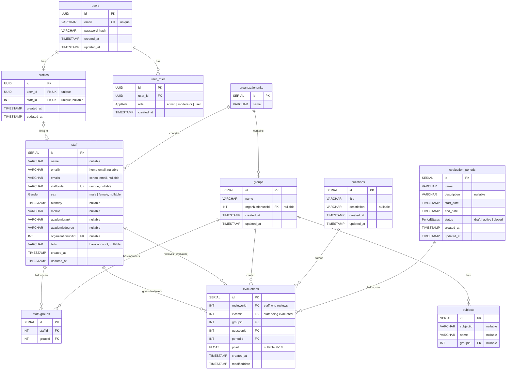
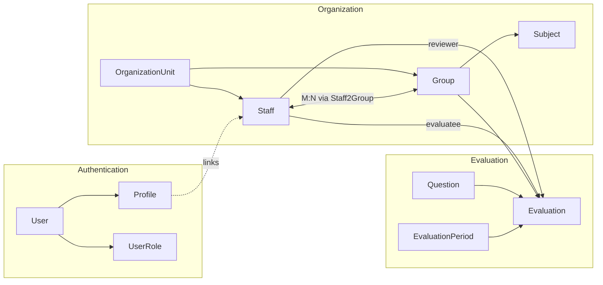

# Staff Evaluation System - ERD

## Entity Relationship Diagram

## Unique Constraints

| Table | Constraint | Columns |
|-------|-----------|---------|
| `users` | UK | `email` |
| `profiles` | UK | `user_id` |
| `profiles` | UK | `staff_id` |
| `user_roles` | UK | `(user_id, role)` |
| `staff` | UK | `staffcode` |
| `staff2groups` | UK | `(staffid, groupid)` |
| `evaluations` | UK | `(reviewerid, victimid, groupid, questionid, periodid)` |

## Cascade Delete Behavior

| Parent | Child | On Delete |
|--------|-------|-----------|
| `users` | `profiles` | CASCADE |
| `users` | `user_roles` | CASCADE |
| `staff` | `staff2groups` | CASCADE |
| `groups` | `staff2groups` | CASCADE |
| `staff` (reviewer) | `evaluations` | CASCADE |
| `staff` (evaluatee) | `evaluations` | CASCADE |
| `groups` | `evaluations` | CASCADE |
| `questions` | `evaluations` | CASCADE |
| `evaluation_periods` | `evaluations` | CASCADE |

## Indexes

| Table | Indexed Columns |
|-------|----------------|
| `staff` | `organizationunitid`, `staffcode` (unique) |
| `groups` | `organizationunitid` |
| `staff2groups` | `staffid`, `groupid` |
| `evaluations` | `reviewerid`, `evaluateeid`, `groupid`, `questionid`, `periodid` |

## Data Flow

