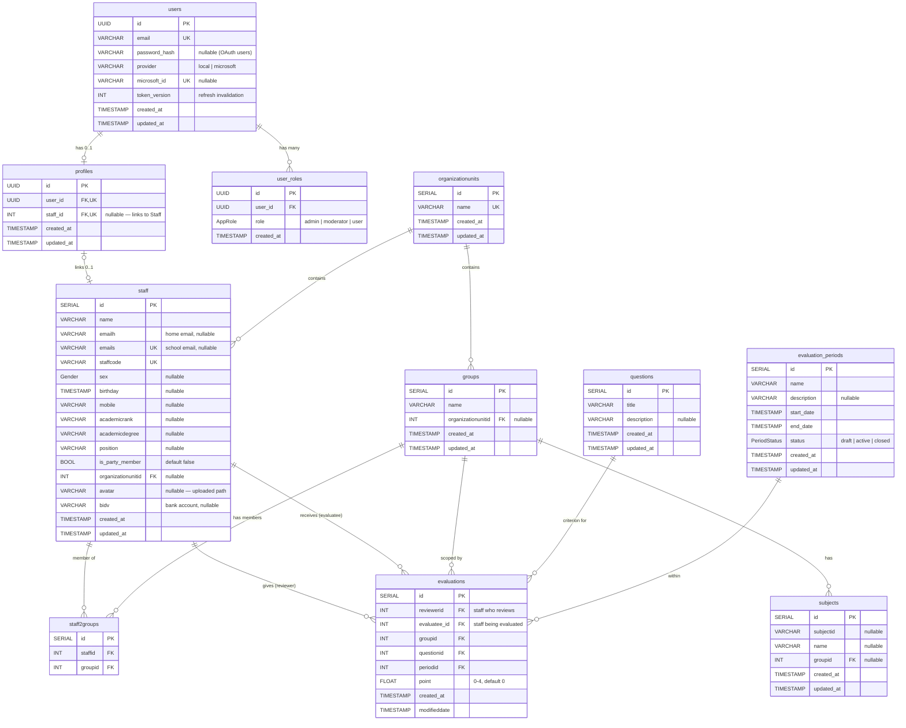
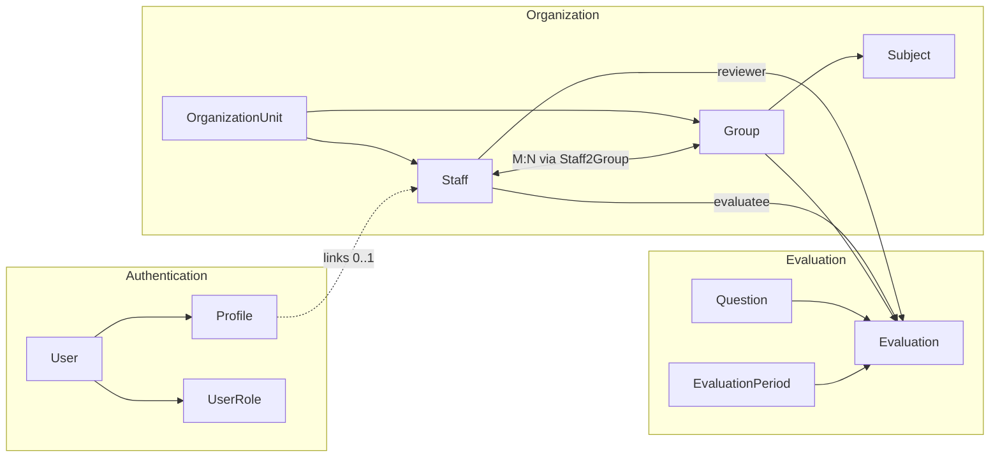

# Staff Evaluation System — ERD

Generated from `staffEvaluation-api/prisma/schema.prisma`.

## Entity Relationship Diagram

## Unique Constraints

| Table | Columns |
|-------|---------|
| `users` | `email` |
| `users` | `microsoft_id` |
| `profiles` | `user_id` |
| `profiles` | `staff_id` |
| `user_roles` | `(user_id, role)` |
| `organizationunits` | `name` |
| `staff` | `staffcode` |
| `staff` | `emails` (school email) |
| `staff2groups` | `(staffid, groupid)` |
| `evaluations` | `(reviewerid, evaluatee_id, groupid, questionid, periodid)` |

## Cascade Delete Behavior

| Parent | Child | On Delete |
|--------|-------|-----------|
| `users` | `profiles` | CASCADE |
| `users` | `user_roles` | CASCADE |
| `staff` | `staff2groups` | CASCADE |
| `groups` | `staff2groups` | CASCADE |
| `staff` (reviewer) | `evaluations` | CASCADE |
| `staff` (evaluatee) | `evaluations` | CASCADE |
| `groups` | `evaluations` | CASCADE |
| `questions` | `evaluations` | CASCADE |
| `evaluation_periods` | `evaluations` | CASCADE |
| `organizationunits` | `staff.organizationunitid` | SET NULL |
| `organizationunits` | `groups.organizationunitid` | SET NULL |
| `staff` | `profiles.staff_id` | default (no cascade) |

## Indexes

| Table | Indexed Columns |
|-------|----------------|
| `staff` | `organizationunitid` |
| `groups` | `organizationunitid` |
| `staff2groups` | `staffid`, `groupid` |
| `evaluations` | `reviewerid`, `evaluatee_id`, `groupid`, `questionid`, `periodid` |
| `evaluations` (composite) | `(reviewerid, periodid)`, `(evaluatee_id, periodid)`, `(evaluatee_id, groupid, periodid)` |

## Domain Data Flow

## Notes

- `User.provider = 'microsoft'` means the user authenticated via Microsoft OAuth; `password_hash` is null in that case.
- `Profile.staff_id` is the bridge between the auth identity (`User`) and the HR record (`Staff`). A user without a linked staff cannot submit evaluations (enforced in `EvaluationsController.ensureStaffLinked`).
- The composite unique constraint on `evaluations` ensures one score per (reviewer, evaluatee, group, question, period) — `bulkUpsert` relies on this for idempotency.
- `point` is validated at `0–4` by the DTO and service layer (`evaluations.service.ts`), although the column itself is an unrestricted `Float`.
- `Staff.emails` (school email) is unique; OAuth linking uses this field to auto-associate a Microsoft account with an existing Staff row.
